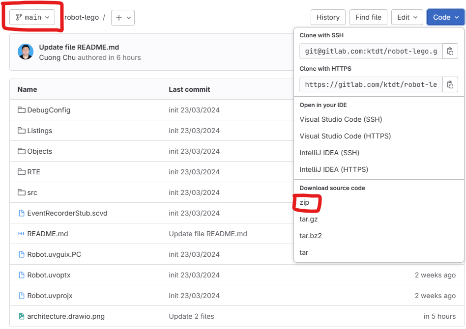
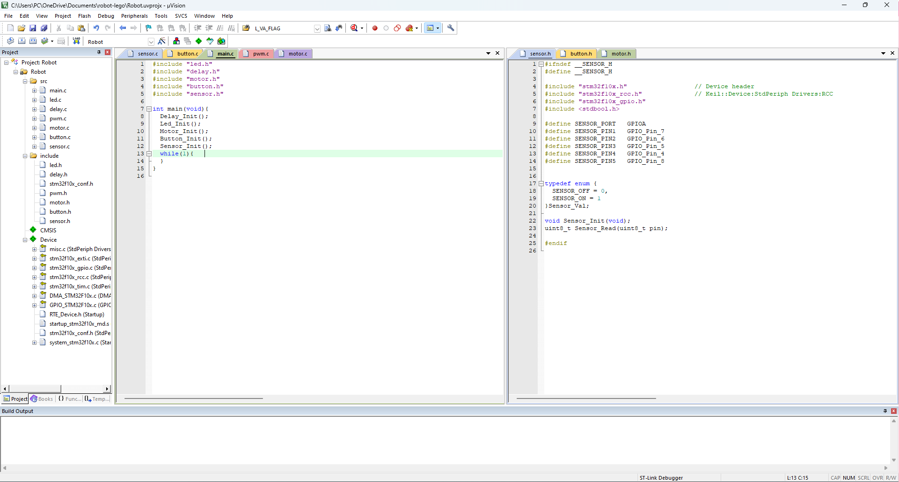

# Vehicle Robot

## Architecture

## Getting started

### 1. Install Keil C step-by-step
[Guide Install](https://ptiteduvn-my.sharepoint.com/personal/biennq_ptit_edu_vn/_layouts/15/onedrive.aspx?id=%2Fpersonal%2Fbiennq%5Fptit%5Fedu%5Fvn%2FDocuments%2F2%2EC%C3%A1c%20m%C3%B4n%20h%E1%BB%8Dc%2F1%2EVi%20x%E1%BB%AD%20l%C3%BD%2F2%2EDocument%2F1%2E%20Ph%E1%BA%A7n%20m%E1%BB%81m&ga=1)

[Install ST-Link V2 Driver](https://tapit.vn/huong-dan-cai-dat-driver-cho-mach-nap-st-link-v2/)

**Step 1: Download Project**



**Step 2: Open Project**



**Step 3: Build and Upload**

### 2. Library (functions)
1. motor
    ```
    void Motor_SetForward(uint8_t motor, uint8_t level);
    void Motor_SetBackward(uint8_t motor, uint8_t level);
    void Motor_SetStopping(uint8_t motor);
    ```
1. sensor
    ```
    uint8_t Sensor_Read(uint8_t pin);
    ```
1. led
    ```
    void Led_On(uint16_t pin);
    void Led_Off(uint16_t pin);
    void Led_Invert(uint16_t pin);
    ```
1. button
    ```
    uint8_t Button_Read(uint8_t pin);
    ```
1. delay
    ```
    void delay(uint16_t time_ms);
    ```
### 3. Programming Space
```
#include "led.h"
#include "delay.h"
#include "motor.h"
#include "button.h"
#include "sensor.h"

int main(void){

    /*      Configure Modules       */
	Delay_Init();
	Led_Init();
	Motor_Init();
	Button_Init();
	Sensor_Init();
    /*              End             */

	while(1){		
        /*     Programming space        */


        /*              End             */
	}
}
```